# StaySmart 🏡
### AI-Enhanced Full-Stack Vacation Rental Platform

[](https://stay-smart-bice.vercel.app/)
[](https://github.com/avinashr925/StaySmart)
[](https://nextjs.org/)
[](https://expressjs.com/)
[](https://www.mongodb.com/)
[](https://deepmind.google/technologies/gemini/)

StaySmart is an AI-enhanced full-stack vacation rental platform designed to provide a streamlined, intelligent booking and listing experience. Built using an **Express + TypeScript MVC REST API** backend paired with a **Next.js 16 (App Router) React & TypeScript** frontend, the platform integrates large language models for query interpretation, geospatial mapping for property discoverability, WebSockets for real-time messaging, and multi-channel payment flows.

---

## 🚀 Live Demo & Codebase
*   **Production URL**: [https://stay-smart-bice.vercel.app/](https://stay-smart-bice.vercel.app/)
*   **GitHub Repository**: [https://github.com/avinashr925/StaySmart](https://github.com/avinashr925/StaySmart)

---

## 📸 Product Showcase

### 1. Home / Landing Page
The landing portal features a clean search entry (address destination, calendar dates, guest capacity counts), quick-access category browse filters (Cabins, Mansions, Beachfront, Apartments), and a grid displaying active vacation stays.

| Hero & Search Portal | Category Listing Browser |
| :---: | :---: |
| 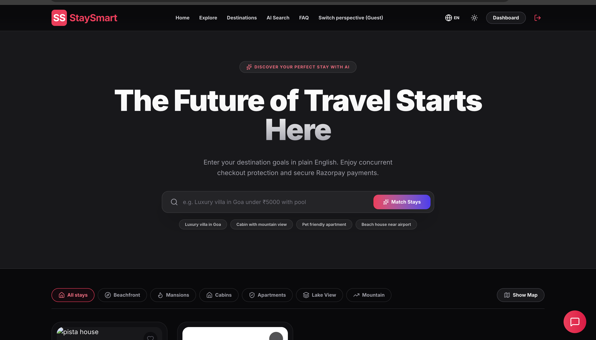 | 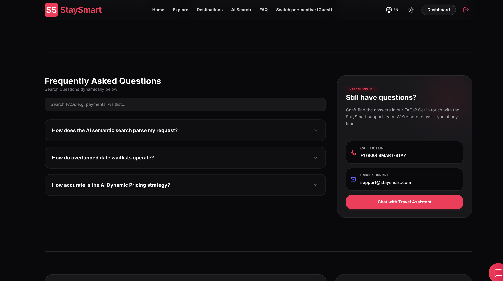 |

---

### 2. Explore & Listings
The Explore page groups stays in a grid layout with smooth hover transition animations. Guests can filter listings using precise parameters: price bounds, guest sizing, bedroom counts, and specific amenity tags.

| Listings Overview Grid | Interactive Leaflet Map Discovery |
| :---: | :---: |
| 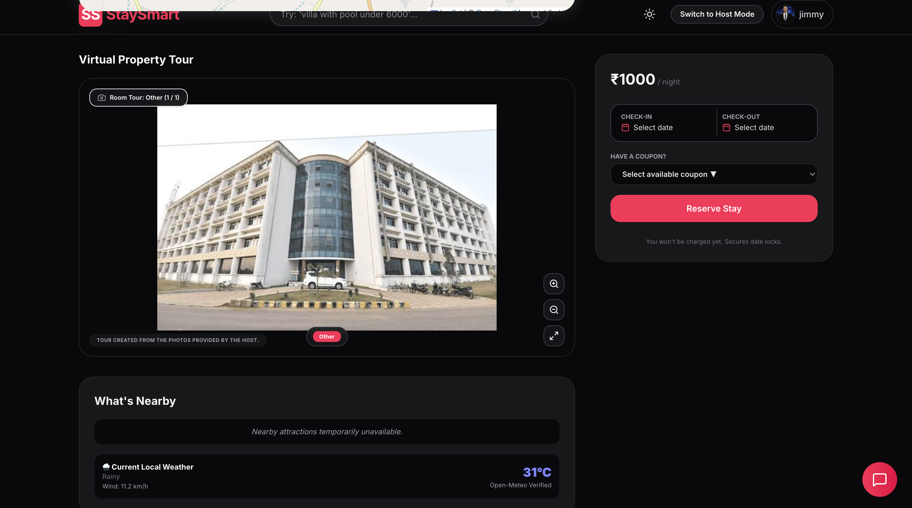 | 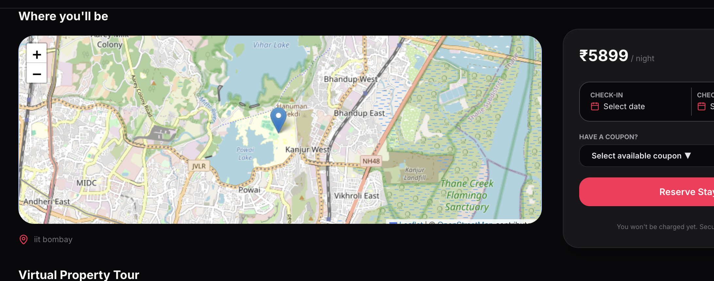 |

---

### 3. AI Travel Assistant
A floating virtual chat guide powered by Google Gemini. The assistant dynamically retrieves matching property choices from MongoDB based on guest chat parameters, drafts customized multi-day travel itineraries, and calculates budget estimates.

<div align="center">
  
</div>

---

### 4. AI Dynamic Pricing
Host control views feature an AI Dynamic Pricing and Revenue Forecasting analyzer. By comparing competitor listings in the same city, evaluating listing metrics, and querying Gemini models, hosts receive nightly price suggestions, profitable floors/ceilings, expected occupancy models, and 12-month revenue estimations.

<div align="center">
  
</div>

---

### 5. Host & operations Dashboard
Hosts manage properties from a central dashboard containing listing status overrides, incoming booking reservation logs, active dynamic price recommendations, and host-issued coupons.

<div align="center">
  
</div>

---

### 6. Booking & Payments Checkout
StaySmart implements a polymorphic payment architecture supporting Razorpay card/wallet gateways, a manual UPI verification form, and local Mock payment adapters.

| Card/Netbanking Checkout | Manual UPI Checkout Form | Transaction Bill Receipt | Booking Success Dialog |
| :---: | :---: | :---: | :---: |
| 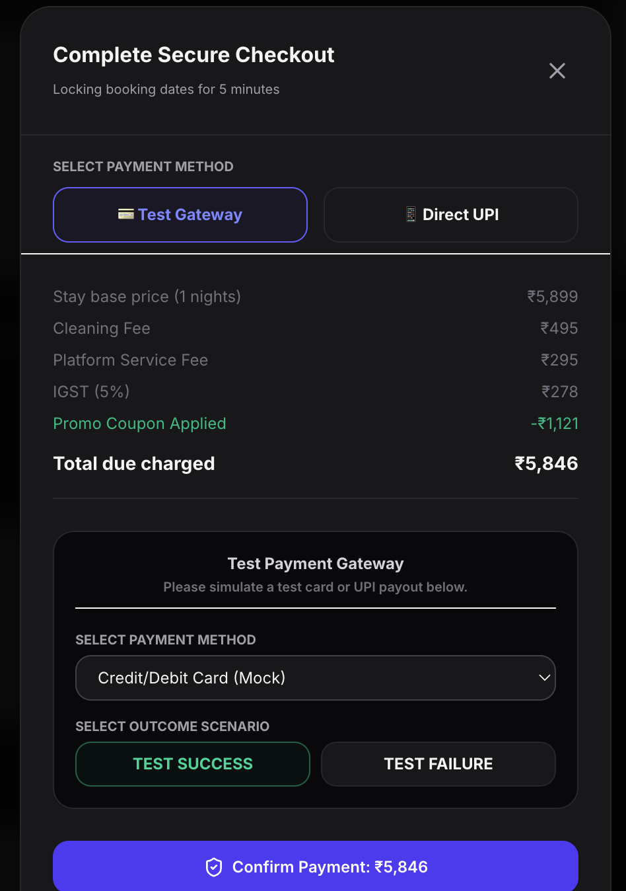 | 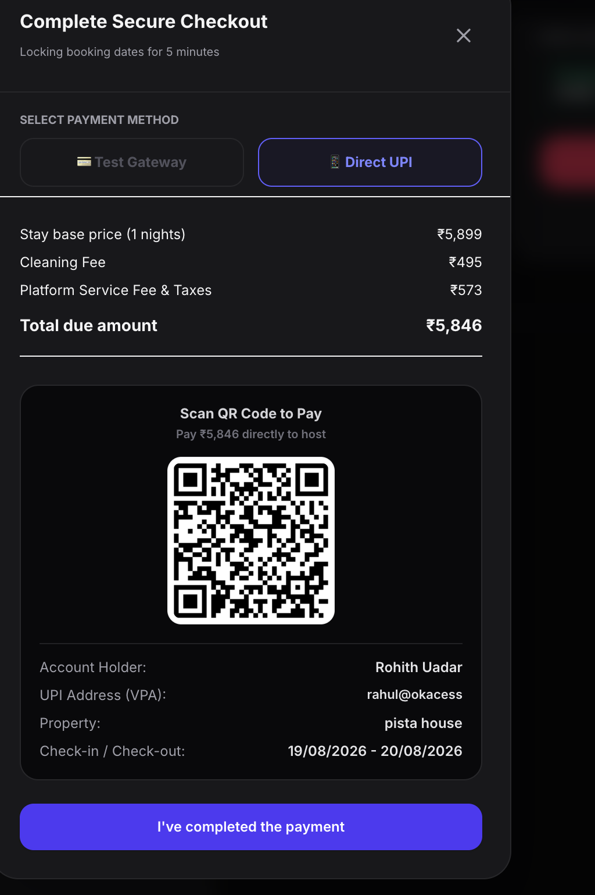 | 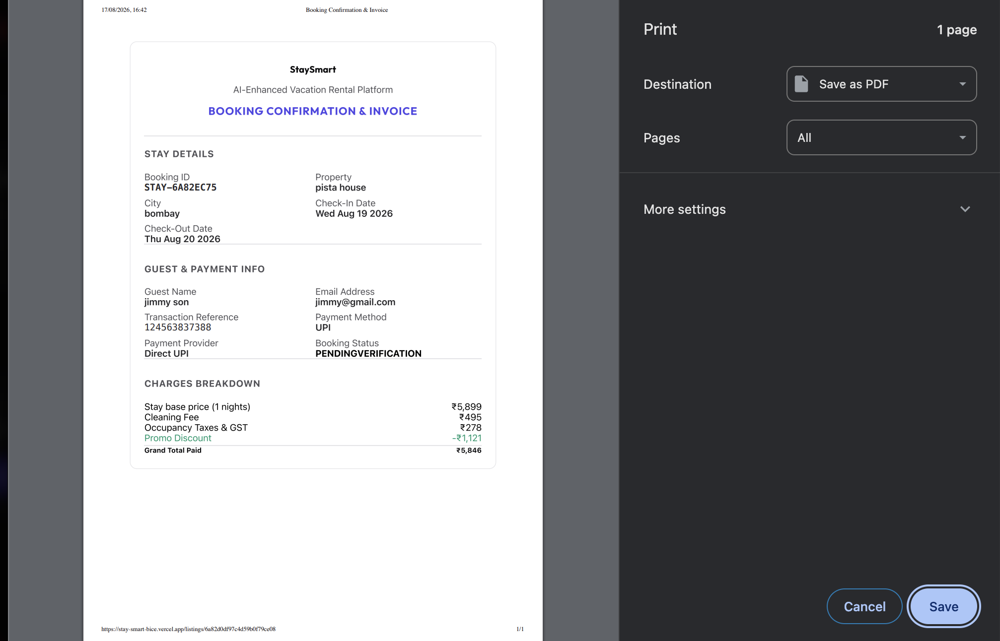 | 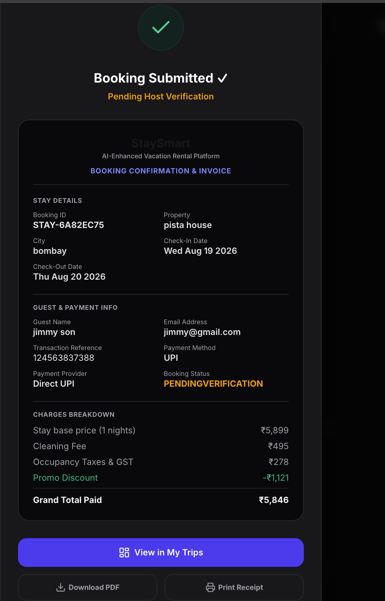 |

---

### 7. Real-Time Chat Inbox
Using Socket.IO, StaySmart integrates direct client-to-client messaging between listings hosts and guests, complete with real-time text delivery, typing indicators, and unread notification increments.

| Theme UI | Light Mode Messaging | Dark Mode Messaging |
| :--- | :---: | :---: |
| **Chat Interface** | 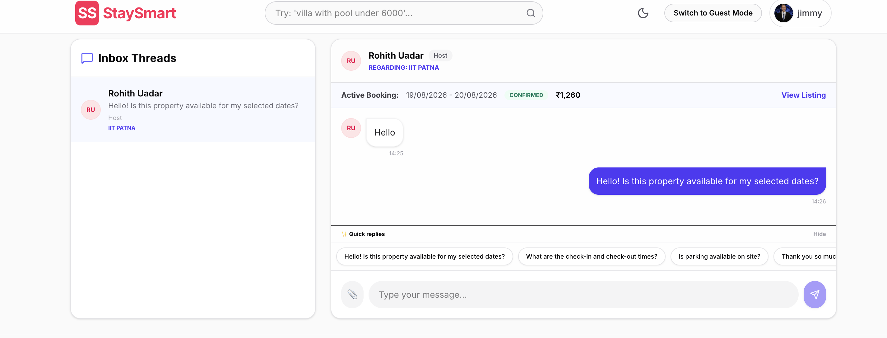 | 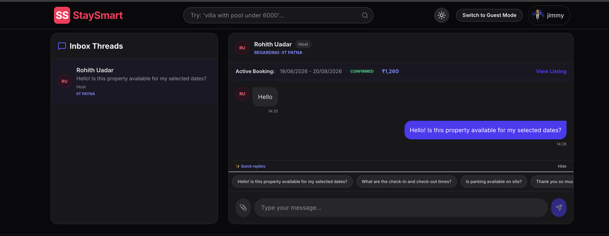 |

---

### 8. Authentication & Themes
StaySmart features native Light/Dark theme configuration states and secure OAuth logins via Google and GitHub.

| Theme UI | Light Theme | Dark Theme |
| :--- | :---: | :---: |
| **Auth Access Portal** | 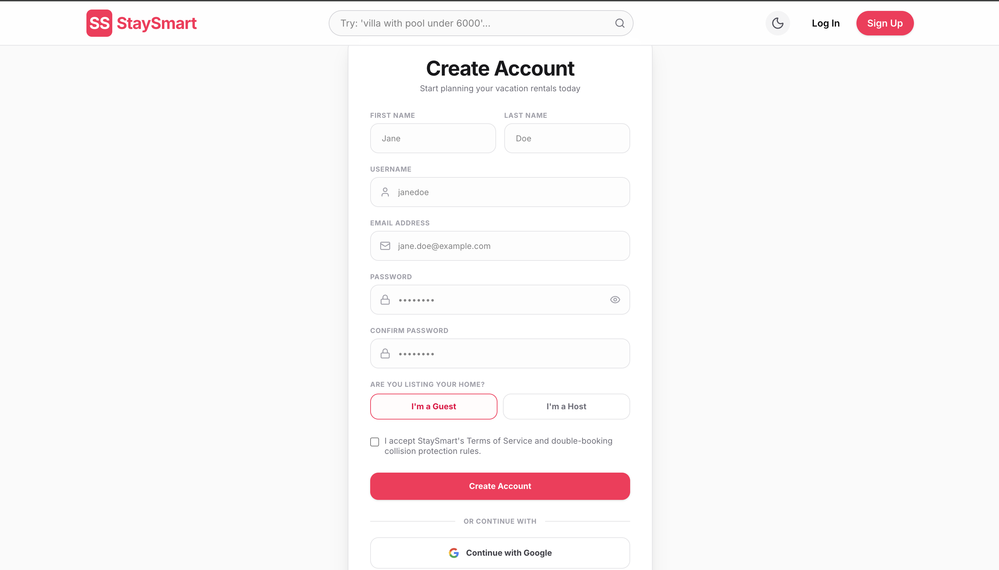 | 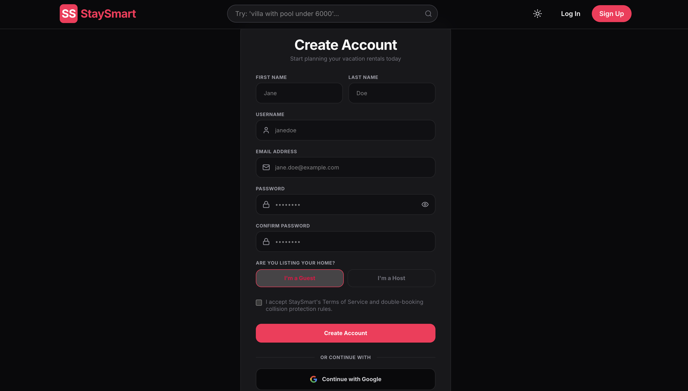 |
| **Host Console** | 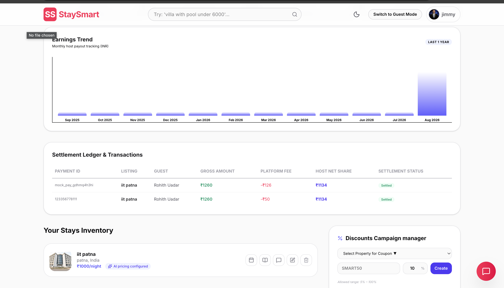 | 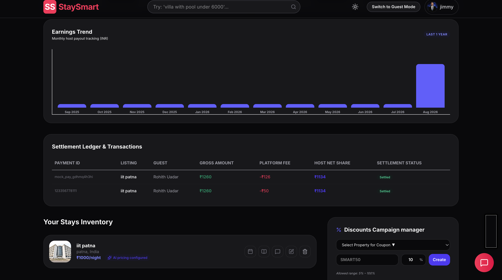 |

<div align="center">
  
</div>

---

## 🧩 Feature Matrix

| Feature Module | Technical Status | Implementation Details / Dependencies |
| :--- | :---: | :--- |
| **Vacation Rental Discovery** | ✅ Implemented | Grid display, category sorting, search filtering, and calendar details |
| **Property Details Page** | ✅ Implemented | Title, description, interactive calendar picker, Leaflet maps, amenities |
| **Interactive Maps** | ✅ Implemented | Leaflet.js mapping library loading geocoded marker positions |
| **Geocoding** | ✅ Implemented | Nominatim OpenStreetMap API mapping address fields to lat/lng coordinates |
| **Reverse Geocoding** | 🔜 Planned | Auto-resolving addresses from direct map pin adjustments |
| **AI Semantic Search** | ⚙️ Configuration-dependent | Gemini-1.5-flash parses query strings to params; falls back to regex keywords |
| **AI Travel Assistant** | ⚙️ Configuration-dependent | Chatbot with DB property injection; falls back to offline itineraries if no API key |
| **AI Dynamic Pricing** | ⚙️ Configuration-dependent | Seasonality checks + competitor ranges + Gemini-based valuation recommendations |
| **Revenue Forecasting** | ⚙️ Configuration-dependent | 12-month occupancy projections using database parameters and LLM analysis |
| **Guest Dashboard** | ✅ Implemented | Listing reservation records, cancellation requests, profile editing, and wishlists |
| **Host Dashboard** | ✅ Implemented | Performance metrics, CRUD listings, checkouts logs, and custom coupon settings |
| **Listing Management** | ✅ Implemented | Complete CRUD operations for host properties |
| **Wishlist / Favorites** | ✅ Implemented | Save listings locally to wishlist database logs |
| **Reviews & Ratings** | ✅ Implemented | Guest reviews with rating scores (1-5), comments, and up to 3 image uploads |
| **Real-time Chat** | ✅ Implemented | Socket.IO WS channels transmitting messages, attachments, and typing states |
| **Light/Dark Mode** | ✅ Implemented | Next-Themes synchronization across all application views |
| **Booking Engine** | ✅ Implemented | Date-collision checks and calendar availability checking |
| **Razorpay Payments** | ⚙️ Configuration-dependent | Razorpay Checkout SDK + webhook verification for order confirmation |
| **UPI Manual Flow** | ✅ Implemented | Manual input fields for UPI transactions + admin verification matching |
| **PDF Invoice** | ✅ Implemented | Server-side PDFKit compilation rendering structured checkout receipts |
| **Authentication** | ✅ Implemented | Credentials password hashing (bcryptjs) + JWT token rotations |
| **OAuth Integration** | ⚙️ Configuration-dependent | Google & GitHub OAuth client validation |
| **Image Upload System** | ⚙️ Configuration-dependent | Cloudinary CDN uploads; falls back to local disk storage in development |
| **Admin Controls** | ✅ Implemented | System metrics, user suspension, host registration approvals, feature flags |
| **Responsive UI** | ✅ Implemented | CSS Tailwind grids, flex containers, and mobile side-drawers |

---

## 🤖 AI & Intelligent Features

StaySmart incorporates generative artificial intelligence via the `@google/generative-ai` SDK, powered by the `gemini-1.5-flash` model. These features fail gracefully to deterministic local rule engines if the Gemini API key is missing.

### 1. AI Semantic Search
*   **User Value**: Lets guests find matching stays using open conversational search phrases rather than manual menu filters (e.g., *"quiet cabin in Goa under ₹5000 with a swimming pool"*).
*   **Technical Mechanism**: Transmits the conversational string to Gemini. The model returns a structured JSON output mapping parsed fields (city, priceMax, propertyType, bedrooms, guests, key search tags, and an explanation parameter `aiRationale`). The backend maps this JSON directly to a MongoDB query.
*   **Fallback Mechanism**: Parses input strings locally using regular expressions for keywords (e.g., "beach", "pool", "ac", "wifi"), numeric bounds for pricing, and matches predefined city tags.

### 2. AI Travel Assistant Chatbot
*   **User Value**: Provides a floating assistant dialog advising users on sightseeing, restaurants, and stay matching.
*   **Technical Mechanism**: Implemented in `AiAssistant.tsx`. Prior to sending the query to Gemini, the backend uses query parameters to fetch up to 8 matching listings from MongoDB (RAG pattern). These properties are injected into the LLM system instructions, prompting the model to recommend real database stays.
*   **Fallback Mechanism**: Returns local concierge replies detailing transport options and basic travel parameters.

### 3. AI Dynamic Pricing & Price Prediction
*   **User Value**: Recommends optimized pricing brackets to listing owners to maximize rental yields.
*   **Technical Mechanism**: Traced in `pricing.ts`. It queries similar listings within the same city. The competitor average, listing ratings, and amenity counts are evaluated by Gemini to predict suggested pricing, occupancy limits, and confidence ratings.
*   **Fallback Mechanism**: Employs mathematical averages of competitor listings in the same city, applying discounts or premiums based on rating thresholds and amenity ratios.

### 4. Revenue Forecasting & Analytics
*   **User Value**: Offers hosts projected revenue statistics to plan property expenses.
*   **Technical Mechanism**: Traced in `forecasting.ts`. It combines base daily prices with seasonal occupancy rates to generate a 12-month revenue curve, highlighting low-demand periods and proposing adjustments (e.g., off-season coupons).
*   **Fallback Mechanism**: Evaluates baseline occupancy averages (65-75% depending on rating) and applies a hardcoded seasonal multiplier array to build chart data.

---

## 🗺️ Maps, Geolocation & Travel Context

Geolocation and mapping features are integrated into search, explore, and details pages.

1.  **Map Display**: Powered by Leaflet.js inside `PropertyMap.tsx`. It processes GeoJSON Point coordinates `[longitude, latitude]` stored in listings, displaying custom marker pins for all properties matching active searches.
2.  **Geocoding Address Translator**: When a host publishes a listing, the controller calls the Nominatim OpenStreetMap API:
    `https://nominatim.openstreetmap.org/search?format=json&q={address}`
    IfNominatim resolves coordinates, they are saved as a GeoJSON point. If it fails, the host is prompted to enter coordinates manually.
3.  **Dynamic Attraction Contexts**: Traced in `geodataService.ts`. Prior to displaying listing details, the backend queries the OpenStreetMap Overpass API for tourism markers, viewpoint nodes, museums, theme parks, restaurants, and cafes within a 1.5km to 3km radius. Results are returned to the details page as "Nearby Attractions".
4.  **Weather Forecasts**: The details page fetches current weather parameters for the property's latitude and longitude from the Open-Meteo API.
5.  **Caching Strategy**: OSM geodata queries and weather responses are cached in a `GeodataCache` MongoDB collection. Weather caches expire in 4 hours, while attraction caches persist for 7 days, preventing third-party rate limits.

---

## 🏠 Host Experience

*   **Host Onboarding**: Hosts complete onboarding before publishing listings. The profile requires banking details (account holder name, encrypted account number, bank name, IFSC, UPI ID) and GST details (GSTIN, legal name).
*   **Listing CRUD**: Hosts publish properties through forms collecting details: title, description, nightly price, street address, category type, capacity limits, rules, and image attachments.
*   **Host Operations Dashboard**: Exposes summary counts (total listings, reservations count, monthly revenue), active property performance status toggles, and dynamic pricing metrics.
*   **Coupon Management**: Hosts issue custom discount codes, tracking usage, active states, and expiry dates.
*   **Reservation Control**: Hosts monitor check-in dates, guest names, total payouts, and active booking statuses (Pending, Confirmed, Cancelled).
*   **Direct Chat**: Hosts chat with guests about check-in parameters directly inside the dashboard workspace.

---

## 👤 Guest Experience

*   **Property Discovery**: Guests browse listings using category sliders, filters, or map searches.
*   **RAG Assistant Chat**: Guests ask the AI assistant for recommendations, receiving selections pulled from MongoDB.
*   **Property Details**: Exposes high-resolution image galleries, amenities lists, host details, previous ratings, local weather forecasts, nearby attractions, and booking calendars.
*   **Wishlist Collections**: Guests toggle stays into wishlists, stored per user in MongoDB.
*   **Checkout & Billing**: Details price breakdowns (accommodation cost, taxes, cleaning fees, platform commission, coupon deductions). Generates server-side PDF invoice receipts.
*   **Feedback Critiques**: Guests submit ratings (1 to 5) and commentary with up to 3 image uploads. The system prevents duplicate critiques from the same guest on a listing.

---

## 🏗️ Technical Architecture

The following diagram illustrates the interaction between the React client, Express API, MongoDB database, and external integrations:

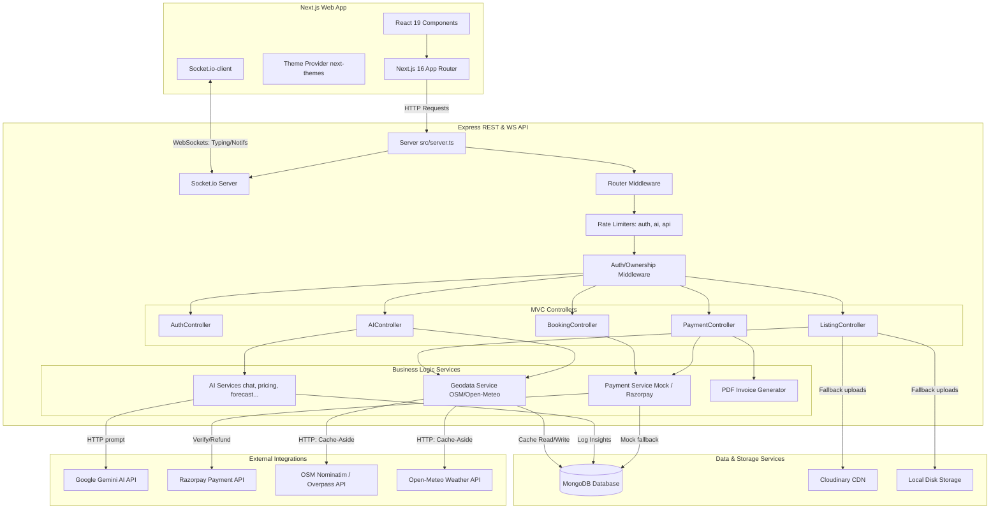

---

## 🛠️ Tech Stack

| Layer | Component | Technologies / Libraries |
| :--- | :--- | :--- |
| **Frontend** | Framework | Next.js 16 (App Router), React 19, TypeScript |
| | Styling | Tailwind CSS v4, Lucide Icons, Framer Motion |
| | Utilities | `socket.io-client`, `react-hot-toast`, `next-themes` |
| **Backend** | Server Engine | Node.js, Express.js, TypeScript |
| | WebSockets | `socket.io` (Real-time message routing & indicators) |
| | Validation | Zod (strict JSON body schema validation) |
| | Document Comp | `pdfkit` (server-side receipt compilation) |
| **Database** | Database Engine | MongoDB |
| | Object Modeling | Mongoose ODM |
| **Integrations** | AI Engine | Google Gemini API (`@google/generative-ai` model: `gemini-1.5-flash`) |
| | Maps & Location | OpenStreetMap Nominatim API (Geocoding), OSM Overpass API (Attractions) |
| | Weather Forecast | Open-Meteo Forecast API |
| | Payment Gateway | Razorpay API Integration, Webhook verified signatures |
| | CDN File Storage | Cloudinary Storage Engine, Multer |
| **Ops & DevOps** | Containerization | Docker, Docker Compose |
| | Health & Status | Custom health probes with exit alerts on DB dropouts |

---

## 🗃️ Database Architecture

StaySmart defines Mongoose schemas with clear relationships:

*   **User (`User`)**: Stores profile details, roles (`Guest`, `Host`, `PropertyManager`, `Admin`, `SuperAdmin`), encrypted bank credentials, payout tokens, default house rules, and IP device login session logs.
*   **Listing (`Listing`)**: Stores property details, price, address, GeoJSON coordinates `[lng, lat]` for geospatial search queries, amenities arrays, blackout intervals, host relations, and virtual tour panoramas.
*   **Booking (`Booking`)**: Manages guest reservations, dates, price breakdowns (taxes, commissions, cleaning fees, applied coupon codes), payment methods, order references, and state machine statuses (`Pending`, `Confirmed`, `Cancelled`, `PaymentFailed`, `Expired`, `PendingVerification`, `Completed`, `Refunded`).
*   **Review (`Review`)**: Ratings (1 to 5) and commentary with supporting attachment URLs. Indexed uniquely on `[listing, author]` to prevent duplicate critiques.
*   **Wishlist (`Wishlist`)**: Maps a single user to a list of listing references.
*   **GeodataCache (`GeodataCache`)**: Caches OpenStreetMap Nominatim lookups, Open-Meteo forecasts, and OSM Overpass attraction responses to avoid rate limits.
*   **Session (`Session`)**: Tracks active user session refresh tokens.
*   **BlacklistToken (`BlacklistToken`)**: Revoked access/refresh JWT signatures for secure logouts.
*   **CheckoutLock (`CheckoutLock`)**: Ephemeral lock documents holding reservation slots for 5 minutes during checking out to prevent double booking.
*   **Coupon (`Coupon`)**: Host-issued discount codes with value metrics, active flags, and expiry checks.
*   **MarketData (`PricingHistory`, `MarketData`)**: Historical records used by heuristic algorithms.

---

## 🔌 API Documentation

### 1. Authentication & Sessions (`/api/auth`)
*   `POST /signup` - Registers Guest/Host account credentials.
*   `POST /login` - Checks credentials; sets HTTP-only JWT cookies.
*   `POST /logout` - Revokes session signatures and clears cookies.
*   `POST /refresh` - Generates fresh access tokens using refresh token rotation.
*   `POST /google` - Login or Register utilizing Google OAuth credentials.
*   `POST /github` - Login or Register utilizing GitHub OAuth credentials.
*   `GET /me` - Returns profile details of the logged-in user.
*   `PATCH /profile` - Update profile bio, phone, languages, or default house rules.
*   `POST /forgot-password` - Dispatches password recovery tokens to specified emails.
*   `POST /reset-password` - Resets passwords using verified reset tokens.
*   `POST /send-otp` - Triggers registration or verification emails with verification codes.
*   `POST /verify-otp` - Validates verification codes.
*   `GET /sessions` - Lists active browser login histories.
*   `DELETE /sessions/:id` - Revokes single active sessions.
*   `DELETE /sessions` - Revokes all other active sessions (logout everywhere).
*   `POST /avatar` - Uploads profile avatar files (multipart files).
*   `DELETE /avatar` - Resets avatar references.
*   `POST /onboard-host` - Saves banking, tax, and GST parameters for payout processing.
*   `POST /sync-payment` - Updates payment profile checks.

### 2. Listings (`/api/listings`)
*   `GET /` - Retrieves listings (filters by city, coordinates distance, price, bedrooms, guests, amenities).
*   `POST /` - Publishes a new property listing (multipart photos + parameters).
*   `GET /:id` - Fetches specific listing details (integrates OSM nearby guides and weather stats).
*   `PUT /:id` - Modifies listing options (ownership checks).
*   `DELETE /:id` - Removes listings (ownership checks).

### 3. Bookings (`/api/bookings`)
*   `POST /` - Places date holds and checks conflicts (Guests only).
*   `GET /guest` - Displays active booking histories for Guests.
*   `GET /host` - Displays incoming reservations for Host properties.
*   `POST /:id/cancel` - Processes cancellations (handles refunds if active).

### 4. Payments & Checkout (`/api/payments`)
*   `POST /checkout` - Establishes lock files and issues Razorpay order details.
*   `POST /confirm` - Verifies Razorpay checkout signatures to confirm stays.
*   `POST /mock/confirm` - Confirms mock checkout order requests.
*   `POST /upi/checkout` - Submits manual UPI requests.
*   `POST /upi/confirm/:bookingId` - Confirms stays using manual UPI reference keys.
*   `POST /webhook` - Receives incoming Razorpay capture notifications.
*   `GET /invoice/:bookingId` - Retrieves JSON invoice configurations.
*   `GET /invoice/:bookingId/pdf` - Compiles and downloads formatted PDF receipt invoices.

### 5. AI Services (`/api/ai`)
*   `POST /search` - Processes semantic search queries.
*   `POST /chat` - Interfaces with the RAG travel concierge (Host or Guest contexts).
*   `GET /recommendations` - Personalizes stay recommendations based on history.
*   `POST /itinerary` - Requests itineraries via Gemini chat.
*   `GET /pricing/:listingId` - Forecasts dynamic nightly values (Host owners only).
*   `GET /forecast/:listingId` - Forecasts revenue models (Host owners only).
*   `GET /optimize/:listingId` - Analyzes SEO listing summaries (Host owners only).
*   `GET /reviews/:listingId` - Synthesizes sentiment pros/cons from reviews (Host owners only).

### 6. Admin Control (`/api/admin`)
*   `POST /approve-host/:hostId` - Approves onboarded host registration requests.
*   `POST /suspend-user/:userId` - Suspends active guest or host accounts.
*   `POST /listings/:listingId/moderate` - Moderates listings (Pending, Approved, Rejected).
*   `GET /feature-flags` - Lists active database feature configurations.
*   `POST /feature-flags` - Updates active system feature flags.
*   `GET /analytics` - Fetches platform revenue and listing statistics.
*   `GET /audit-logs` - Inspects user behavior audit histories.

---

## 💻 Local Development

### Prerequisites
*   **Node.js**: Version 20.x or higher
*   **MongoDB**: Local MongoDB instance or Dockerized service running on `mongodb://127.0.0.1:27017`

### 🔑 Environment Variables Setup

#### 1. Backend Environment Configuration (`backend/.env`)
Create a `.env` file under the `/backend` directory:
```env
# Server Network Parameters
PORT=8080
FRONTEND_URL=http://localhost:3000
NODE_ENV=development

# Database Setup
MONGO_URL=mongodb://127.0.0.1:27017/staysmart

# JWT Token Configurations
JWT_ACCESS_SECRET=your_secure_jwt_access_secret_key_here
JWT_REFRESH_SECRET=your_secure_jwt_refresh_secret_key_here
JWT_ACCESS_EXPIRE=15m
JWT_REFRESH_EXPIRE=7d

# Google OAuth Configuration
GOOGLE_CLIENT_ID=your_google_client_id_here
GOOGLE_CLIENT_SECRET=your_google_client_secret_here

# GitHub OAuth Configuration
GITHUB_CLIENT_ID=your_github_client_id_here
GITHUB_CLIENT_SECRET=your_github_client_secret_here

# Google Gemini AI Integration
GEMINI_API_KEY=your_google_gemini_api_key_here
GEMINI_MODEL=gemini-1.5-flash

# Cloudinary Storage Settings (Falls back to local disk storage in development if omitted)
CLOUDINARY_CLOUD_NAME=your_cloudinary_name_here
CLOUDINARY_API_KEY=your_cloudinary_api_key_here
CLOUDINARY_API_SECRET=your_cloudinary_api_secret_here

# Payout Providers (MOCK or RAZORPAY)
PAYMENT_PROVIDER=MOCK
RAZORPAY_KEY_ID=your_razorpay_key_id_here
RAZORPAY_KEY_SECRET=your_razorpay_key_secret_here
RAZORPAY_WEBHOOK_SECRET=your_razorpay_webhook_secret_here

# Transactional Mail (Falls back to printing details in console if omitted)
SMTP_HOST=smtp.mailtrap.io
SMTP_PORT=2525
SMTP_USER=your_smtp_username_here
SMTP_PASS=your_smtp_password_here
SMTP_FROM="StaySmart Vacation Rentals" <noreply@staysmart.com>
```

#### 2. Frontend Environment Configuration (`frontend/.env`)
Create a `.env` file under the `/frontend` directory:
```env
NEXT_PUBLIC_API_URL=http://localhost:8080/api
NEXT_PUBLIC_GOOGLE_CLIENT_ID=your_google_client_id_here
NEXT_PUBLIC_GITHUB_CLIENT_ID=your_github_client_id_here
```

---

### Command Guide

#### 1. Setup & Seeding
Install dependencies and verify the database connection:
```bash
# Set up backend
cd backend
npm install
npm run seed
```
> [!NOTE]
> `npm run seed` connects to MongoDB to verify connection strings. In alignment with database integrity, it does not inject dummy accounts or duplicate listings. These are created dynamically during application use.

To clean up or purge test data during local development:
```bash
# Clear all application collections from the local database
npm run db:reset

# Purge mock bookings and generated assets
npm run purge:demo
```

#### 2. Running Services Locally
Start the backend Express server:
```bash
# Start backend (auto-compiles and restarts on edits)
cd backend
npm run dev
```
The backend service binds to `http://localhost:8080`. You can inspect the interactive API spec by opening `http://localhost:8080/api-docs`.

Start the Next.js React client:
```bash
# Start frontend Next.js server
cd ../frontend
npm install
npm run dev
```
Open `http://localhost:3000` to browse, book, or host on StaySmart!

---

### 🐳 Docker Compose Deployment
To compile and start the Next.js web client, Express API server, and MongoDB container automatically:
```bash
# Build and run Docker containers
docker compose up --build
```
This builds and binds the services:
*   **Web Portal**: `http://localhost:3000`
*   **REST Server**: `http://localhost:8080`
*   **MongoDB**: `localhost:27017`

---

## 🔒 Security Features
StaySmart prioritizes system security and customer information privacy:
1.  **Authentication Security**: JWT Access + Refresh token rotations. Access tokens are kept short-lived (15 minutes), and revoked tokens are blacklisted.
2.  **Resource-Level Guards**: Middleware validates that listing updates, bookings, invoices, and review deletions are executed exclusively by the resource owner or an administrator.
3.  **Authentication Rate Limiter**: Core paths are guarded against brute-force attacks via `express-rate-limit`. Tighter limits are applied to auth and Gemini query routes to manage API costs.
4.  **No-Exposure Configs**: All system access keys, Gemini endpoints, Cloudinary configurations, and database credentials remain hidden behind `.env` boundaries.
5.  **Double-Booking Locks**: A 5-minute database locking mechanism is used on checkout initialization to prevent concurrent bookings for the same date ranges.

---

## 🗺️ Future Roadmap
The following features are planned for future releases:
*   **Stripe Checkout Integration**: Adding alternative gateway options for international customers.
*   **Comprehensive Analytical Charts**: Advanced metrics for host occupancy, monthly revenues, and seasonal listing trends.
*   **Push Notifications**: Replacing email notices with direct web app notifications using Socket.io or Web Push.
*   **Interactive Virtual Tour Designer**: An interface for hosts to map panoramas and place navigation hotspots manually.

---

## ✍️ Author
*   **Gumma Avinash**
*   Computer Science & Engineering
*   Indian Institute of Technology Patna (IIT Patna)
*   **GitHub**: [https://github.com/avinashr925](https://github.com/avinashr925)
